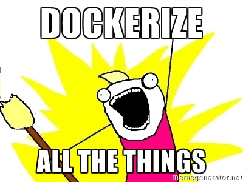

# Dockerize all the things™️



## What is Docker

> Docker is an open platform for developing, shipping, and running applications. Docker enables you to separate your applications from your infrastructure so you can deliver software quickly. With Docker, you can manage your infrastructure in the same ways you manage your applications. By taking advantage of Docker’s methodologies for shipping, testing, and deploying code quickly, you can significantly reduce the delay between writing code and running it in production.
> Docker allows you to package an application with all of its dependencies into a standardized unit for software development.

- released in 2013
- once-in-a-decade shift in infrastructure
  - 90’s - Mainframe to PC
  - 00’s - Baremetal to Virtual
  - 10’s -Datacenter to Cloud (AWS)
  - Now - Host to Container
- Created with developers in mind
- Predictions: by 2020, more than 50% of global organizations will be running containers in production
- Containers reduce complexity (run the same way)
- 80% maintenance, 20% inovation before Docker
- PayPal migrated 700+ apps -> 50% dev productivity boost -> 66% cost reduction
- Just a piece of the puzzle, all tooling options found on [Cloud Native Interactive Landscape](https://landscape.cncf.io)

## Docker Engine

Docker Engine is a client-server application with these major components:

- A server which is a type of long-running program called a daemon process (the `dockerd` command).
- A REST API which specifies interfaces that programs can use to talk to the daemon and instruct it what to do.
- A command line interface (CLI) client (the docker command).


Source: [Docker.com](https://docs.docker.com/engine/docker-overview/)

## Docker Architecture


Source: [Docker.com](https://docs.docker.com/engine/docker-overview/)

## Images and Containers

- `image`:
  - app binaries and dependencies
  - metadata about the image data and how to run the image
  - NOT a complete OS. No kernel, no kernel modules (eg: drivers)
  - small as one file
  - big as Ubuntu
- `container`:
  - they are just processes
  - limited to what resource they can access
  - exit when process stops

## Dockerfile

[Reference](https://docs.docker.com/engine/reference/builder/)

Each instruction creates one layer:

1. `FROM <image> [AS <name>]` - this is the foundation of our image, the parent image. Recommended to use a minimum distribution like `alpine`, eg:

   - `node:13.0.1-alpine` ~ 105MB (36.13 MB compressed)
   - `ruby:2.6.5-alpine` ~ 50MB (24.15 MB compressed)

   Other images:

   - Alpine `alpine:latest` ~ 2.66 MB
   - Ubuntu `ubuntu:xenial` ~ 42.11 MB
   - MySQL `mysql:latest` ~ 127.82 MB

2. `ENV <key> <value>` - used when building and running a container

   ```Dockerfile
    ENV MY_NAME John Doe
    ENV MY_DOG Rex The Dog
    ENV MY_CAT fluffy
   ```

3. `WORKDIR /path/to/workdir` - sets the working directory for any `RUN`, `CMD`, `ENTRYPOINT`, `COPY` and `ADD` instructions that follow
4. `COPY [--chown=<user>:<group>] <src>... <dest>` - copies new files or directories from `<src>` and adds them to the filesystem of the container at the path `<dest>`
   - Tip: if you’re copying in local files to your Docker image, always use `COPY` because it’s more explicit
5. `ADD [--chown=<user>:<group>] <src>... <dest>` - copies new files, directories or remote file URLs from `<src>` and adds them to the filesystem of the image at the path `<dest>`
   - Tip: use it when you wan't to use a URL instead of a local file or extract a tar file from the source directly into the destination
6. `RUN <command>` - shell form, the command is run in a shell, which by default is /bin/sh -c on Linux or cmd /S /C on Windows
7. `EXPOSE <port> [<port>/<protocol>...]` - informs Docker that the container listens on the specified network ports at runtime
8. `CMD` - has three forms:
   - `CMD ["executable","param1","param2"]` (exec form, this is the preferred form)
   - `CMD ["param1","param2"]` (as default parameters to ENTRYPOINT)
   - `CMD command param1 param2 (shell form)`
   - The main purpose of a `CMD` is to provide defaults for an executing container. These defaults can include an executable, or they can omit the executable, in which case you must specify an ENTRYPOINT instruction as well.
9. `ENTRYPOINT` has two forms:

   - `ENTRYPOINT ["executable", "param1", "param2"]` (exec form, preferred)
   - `ENTRYPOINT command param1 param2 (shell form)`
   - allows you to configure a container that will run as an executable, eg:

   ```bash
   docker run -i -t --rm -p 80:80 nginx
   ```

## Docker compose

- Why?
  - configure relationships between containers
  - save our docker container run settings in easy-to-read file
  - create one-liner developer environment startups
- CLI tool comes with Docker for Windows/Mac
- Not a production-grade tool but ideal for local development and test
- Two most common commands are
  - `docker-compose up` # setup volumes/networks and start all containers
  - `docker-compose down` # stop all containers and remove cont/vol/net
- If all your projects had a Dockerfile and docker-compose.yml then "new developer onboarding" would be:

  - `git clone github.com/some/software`
  - `docker-compose up`

## Hands-on tutorial

Prerequisite:

- Docker installed locally
- Clone this repo

Then start with:

1. `cd workspace`
2. `code .`
3. In the root folder each project create the required files:
   - `Dockerfile` - a recipe for creating an image
   - `.dockerignore` - prevents unwanted files and folders to be added to the docker image (eg: `node_modules/`, `dist/`)
   - `docker-compose.yml` - configure relationships between containers`

## Cleanup

```bash
docker system prune -a
> Total reclaimed space: 11.81GB
```

## Courses and Tutorials

- [Docker Mastery - Udemy](https://www.udemy.com/course/docker-mastery)
- [Docker Docs](https://docs.docker.com)
